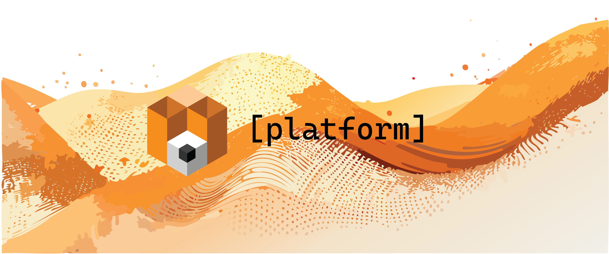

<div align="center">



<a name="readme-top"></a>

A secure, high-performance validator for Platform Network that executes challenges<br/>in TDX-secured VMs via dstack, using confidential computing with end-to-end security,<br/>built with [Rust](https://www.rust-lang.org/) and [Dstack-TEE](https://github.com/Dstack-TEE/dstack).

[![Rust version][rust_version_img]][rust_url]
[![License][repo_license_img]][repo_license_url]

**↗️ The official Platform Validator documentation ↗️**

[Getting Started](docs/getting-started.md) · [Architecture](docs/architecture.md) · [Usage](docs/usage.md) · [Security](docs/security.md) · [API Reference](docs/api-reference.md)

</div>

> [!CAUTION]
> The Platform Validator is currently in early development. Some features may be incomplete, APIs may change, and potential security vulnerabilities may exist. The team is actively testing to ensure everything is properly implemented and stable. Not ready for production use.

## Related Projects

Platform Network consists of several interconnected components that work together to provide a secure, decentralized challenge evaluation system:

| Project | Repository | Description |
|---------|-----------|-------------|
| **Platform Validator** | [PlatformNetwork/platform](https://github.com/PlatformNetwork/platform) | Secure, high-performance validator built in Rust that executes challenges in TDX-secured VMs via dstack VMM. Manages job execution, challenge lifecycle, CVM provisioning, resource quota allocation, and result submission. Provides WebSocket connectivity to Platform API and challenge CVMs. |
| **Challenge SDK** | [PlatformNetwork/challenge](https://github.com/PlatformNetwork/challenge) | Modern Python SDK for building verifiable challenges on Platform Network. Provides decorator-based lifecycle management, encrypted WebSocket communication with TDX attestation, automatic database migrations, custom weights calculation, and public API endpoints. |
| **Platform API** | [PlatformNetwork/platform-api](https://github.com/PlatformNetwork/platform-api) | Central orchestrator and API service for Platform Network. Built in Rust with Axum, manages challenge deployment and configuration, job queuing and distribution, validator coordination, TDX/SGX/SEV-SNP attestation verification, ORM bridge for secure database access, token emission scheduling, and public endpoint proxying. |
| **Terminal Challenge** | [PlatformNetwork/term-challenge](https://github.com/PlatformNetwork/term-challenge) | A secure Terminal Challenge for evaluating Terminal-Bench agents on Platform Network. Enables developers to run and monetize their terminal-based AI agents through isolated evaluation environments, performance-based rewards, and continuous improvement through encrypted competitive collaboration. |

## Features

- **TDX-Secured Execution**: Runs challenges in isolated TDX VMs with hardware attestation
- **Job Management**: Automated job claiming, execution, and result submission
- **Challenge Monitoring**: Automatic detection of challenge updates via GitHub commit monitoring
- **Resource Management**: Intelligent CVM quota management with resource capacity tracking
- **Network Isolation**: Configurable network whitelist policies for challenge execution
- **WebSocket Support**: Real-time notifications for new jobs and challenge updates
- **Dynamic Values**: Secure key-value storage for challenge state management
- **Platform Integration**: Full integration with Platform API for challenge and job management

<div align="right">

[↗ Back to top](#readme-top)

</div>

## Quick Start

> [!NOTE]
> Platform Validator requires Rust 1.70 or higher and access to a dstack VMM instance.

Install and build the validator:

```console
git clone https://github.com/PlatformNetwork/platform-validator.git
cd platform-validator
cargo build --release
```

Configure and run:

```bash
export VALIDATOR_HOTKEY="5DD..."
export PLATFORM_BASE_API="http://platform-api:3000"
export DSTACK_VMM_URL="http://dstack-vmm:11530"
export VALIDATOR_CPU_CORES=4
export VALIDATOR_MEMORY_MB=2048

./target/release/validator
```

See [Getting Started](docs/getting-started.md) for detailed installation and configuration instructions.

## Documentation

For complete documentation, see:

- **[Getting Started](docs/getting-started.md)** - Installation, prerequisites, and quick start guide
- **[Architecture](docs/architecture.md)** - System architecture, components, and Platform API/Validator roles
- **[Usage](docs/usage.md)** - Validator lifecycle, job execution, challenge management, and configuration
- **[Security](docs/security.md)** - Security architecture, TDX attestation, CVM isolation, and network policies
- **[API Reference](docs/api-reference.md)** - Complete API documentation for all endpoints and components
- **[CVM Setup](docs/cvm-setup.md)** - Comprehensive guide for deploying validator as CVM
- **[Development](docs/development.md)** - Development setup, project structure, Rust tooling, and contributing
- **[Troubleshooting](docs/troubleshooting.md)** - Common errors and solutions

## License

```
Copyright 2025 Cortex Foundation

Licensed under the MIT License.

See LICENSE file for details.
```

<div align="right">

[↗ Back to top](#readme-top)

</div>

---

<div align="center">

**[Back to top](#readme-top)**

Made with love by the Cortex Foundation

</div>

<!-- Rust links -->

[rust_url]: https://www.rust-lang.org/
[rust_version_img]: https://img.shields.io/badge/Rust-1.70+-blue?style=for-the-badge&logo=rust

<!-- Repository links -->

[repo_license_url]: https://github.com/PlatformNetwork/platform-validator/blob/main/LICENSE
[repo_license_img]: https://img.shields.io/badge/license-MIT-blue?style=for-the-badge&logo=none
